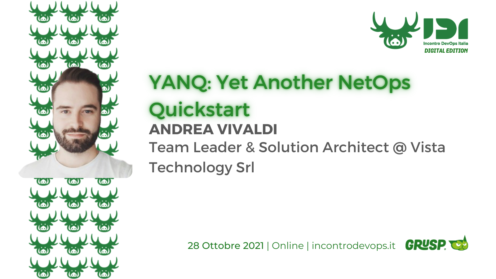
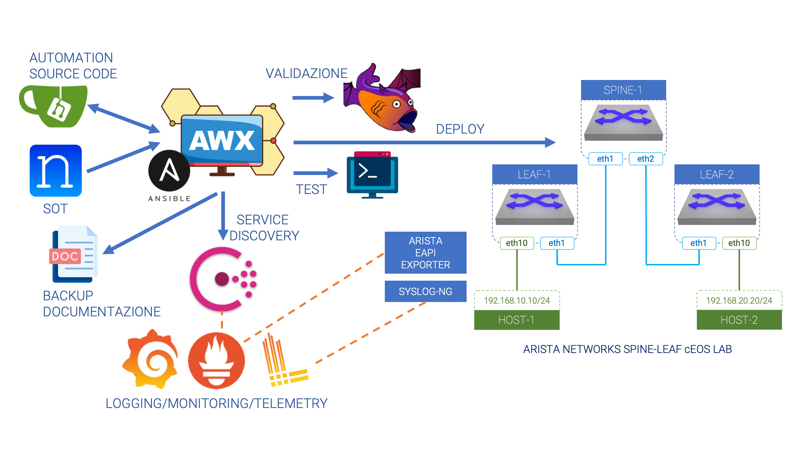

# YANQ: Yet Another NetOps Quickstart - Talk IDI (Incontro DevOps Italia) 2021


This repository contains slides and demo code presented during the [IDI 2021](https://2021.incontrodevops.it/) event hosted by [Grusp](https://www.grusp.org/): https://2021.incontrodevops.it/talks_speakers/#talk1 (sorry foreign fellows... it's and italian talk)

# Slides content
You can find an english translation of the slides [here](./slides/)

# Demo Architecture


## Components

### Arista cEOS Topology

We are testing our environment with a simple 3-nodes Spine/Leaf topology. We have chosen rely on [Arista](https://www.arista.com/en/) technology beacuse of the flexibility and semplicity they provide. In fact we are using containerized EOS images in conjunctions with [Docker-topo NG](https://github.com/Vista-Technology/docker-topo-ng), a software that allows you to replicate a network topology using docker technologies.

We also added to Host nodes, one per Leaf, useful to test network connectivity if everything is ok.

### Nautobot

### Gitea

### Ansible+AWX
We make use of 3 simple, demostrative, [Ansible](https://www.ansible.com/) playbooks to perform all the **automation** staff.

> Note: Even the creating process of all the demo environment is built with Ansible

Ansible automation is launched by the Gitlan pipeline. We have devided all the stuff in 3 topics:
* Automatically launch **validation** processes
  * _playbooks/validate.yaml_
* Auotmatically deploy **configurations** on devices, and configure the monitoring stack
  * _playbooks/intended.yaml_
* Automatically **test** the final environment
  * _playbooks/ping.yaml_

Inside the _automation_ folder of this project you can find all files related to Ansible automation, regarding the NetOps process.
We use some collections and roles to perform the tasks (as you can see in the _requirements.yaml_ file):
* Collections:
  * lvrfrc87.git_acp
  * arista.eos
* Roles:
  * batfish.base

The arista.eos collection is the key to perform configuration deployment on the devices

```yaml
---
- name: Configure device
  arista.eos.eos_config:
    src: template-config-all.j2
    replace: config
    match: none
```
We use a jinja2 template, filled with IaC variables, to get the final configuration

### Batfish
[Batfish](https://www.batfish.org/) is an open source **network configuration analysis** tool.

We have deployed a Batfish server inside our stack and we run some simple demostrative **validation** against it. As described before, we run this validations using Ansible automation.

For example, we want to validate BGP neighbourship
```yaml
- name: Generate intended config to test
  template:
    src: config.j2
    dest: "validation/workshop/configs/{{inventory_hostname}}"

- name: Setup connection to Batfish service
  bf_session:
    host: localhost
    name: local_batfish
  delegate_to: localhost
  run_once: true

- name: Initialize the example network
  bf_init_snapshot:
    network: workshop
    snapshot: workshop
    snapshot_data: ../validation/workshop
    overwrite: true
  run_once: true
  delegate_to: localhost

- name: Retrieve Batfish Facts
  bf_extract_facts:
    output_directory: ../validation/workshop/data/bf_facts
  register: bf_facts
  run_once: true
  delegate_to: localhost

- name: Display neighbourships for all nodes
  debug:
    msg: " {{item.value.BGP.Neighbors}} "
  with_dict: "{{bf_facts.result.nodes}}"
  loop_control:
    label: "{{item.key}}.BGP.Neighbors"
  run_once: true
  delegate_to: localhost

- name: Validate the configuration of network devices
  bf_assert:
    assertions:
      - type: assert_no_undefined_references
        name: Confirm that there are NO undefined references on any network device
      - type: assert_no_incompatible_bgp_sessions
        name: Confirm that all BGP peers are properly configured
      - type: assert_no_unestablished_bgp_sessions
        name: Confirm that all compatible BGP peers establish sessions
  run_once: true
  delegate_to: localhost
```

### Consul
We have introduced [Consul]() simply to simulate a **service discovery** component inside our **automation** stack.

This kind of objects are very usefull when we have to deal with automation tasks. In this way, within the _intended.yaml_ playbook, we can *register* a device to be monitored by the monitoring tools without specify any further configuration inside Prometheus

```yaml
---
- name: Register Consul service
  community.general.consul:
    service_name: "Arista Monitoring"
    service_port: "{{ metrics_port }}"
    service_id: "{{ inventory_hostname }}"
    service_address: "{{ ansible_host }}"
    host: "{{ consul_host }}"
    tags: 
      - "_device={{ inventory_hostname }}"
```

Prometheus itself has a service discovery plugin to be able to get hosts from registered device inside Consul.

### Prometheus, Loki and Grafana
Finally, as a complete Monitoring/Telemetry/Log aggregation stack we have chosen:
* [Prometheus](https://prometheus.io/)
  * scrapes metrics information of the Arista devices, both directly (thanks to OCPrometheus daemon inside EOS) and via custom eAPI exporter (just for demonstration sake, it is absolutely not necessary to run both mechanisms)
* [Loki](https://grafana.com/oss/loki/)
  * scrapes devices logs, through the help of [Promtail](https://grafana.com/docs/loki/latest/clients/promtail/) (make log available for scraping) component and [Syslog-NG](https://www.syslog-ng.com/) ( first catches and parses logs)
* [Grafana](https://grafana.com/oss/grafana/)
  * provides visualization dashboards

## How to reproduce the demo environment

 There are some requirements to reproduce this demo enviroment:
* python3
* pip3
* Python virtualen
* Docker
* Docker Compose
* Ansible

### AWX

First of all, we need to clone AWX 17.1.0 and move to `installer\`

```bash
git clone -b 17.1.0 https://github.com/ansible/awx.git
cd installer\
```

in this directory you will find:
```
installer
|-- build.yml
|-- install.yml
|-- inventory
`-- roles
```
Inside of `inventory`, you will find all parameters that you might need to change like `admin_user` and `admin_password`. 
You might want to change the default `admin:password` with something more robust like `admin:IDI2021` 🙂 .

then, run the playbook `install.yml` with the inventory previously edited.
```bash
sudo ansible-playbook install.yml -i inventory
```
> This procedure will take some time and may take more than one try to reach the end.

when everything is complete you will find a new directory `~\.awx` in this directory you will find the docker-compose used to run all the AWX stack.

At this point, everything is up and running!


> You can access AWX by the IP address of your host. By default, the Web service will be exposed at port 80.

### everything else

All the other components of the stack like Grafana, Prometheus, Gitea, Batfish, Nautobot, and the exporters will be deployed in a single docker-compose.yml


