# YANQ: Yet Another NetOps Quickstart - Talk IDI (Incontro DevOps Italia) 2021


This repository contains slides and demo code presented during the [IDI 2021](https://2021.incontrodevops.it/) event hosted by [Grusp](https://www.grusp.org/): https://2021.incontrodevops.it/talks_speakers/#talk1 (sorry foreign fellows... it's and italian talk)

# Slides content
You can find an english translation of the slides [here](./slides/)

# Demo Architecture


## Components

### Arista cEOS Topology

We are testing our environment with a simple 3-nodes Spine/Leaf topology. We have chosen rely on [Arista](https://www.arista.com/en/) technology beacuse of the flexibility and semplicity they provide. In fact we are using containerized EOS images in conjunctions with [Docker-topo NG](https://github.com/Vista-Technology/docker-topo-ng), a software that allows you to replicate a network topology using docker technologies.

We also added to Host nodes, one per Leaf, useful to test network connectivity if everything is ok.

### Nautobot

Nautobot is an open source IPAM/DCIM developed by NetworkToCode team, and it's very flexible and customizable. We will use it as our Source of Truth (SOT).

In fact we will store any sort of information in it.

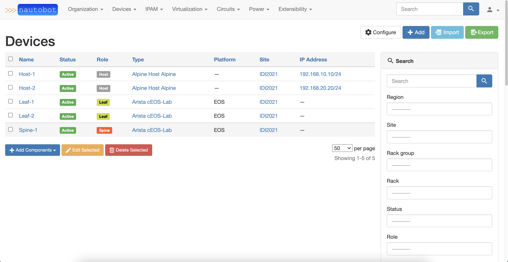

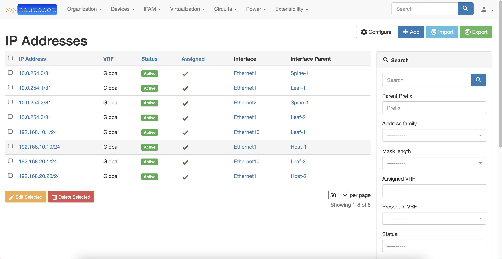

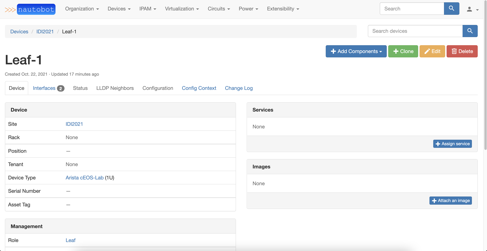

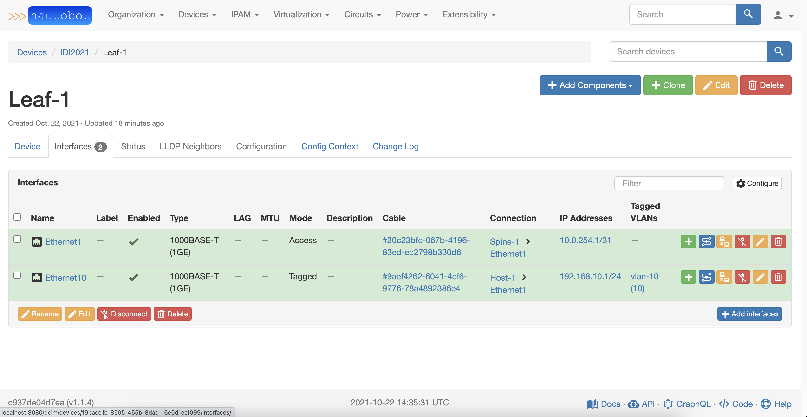

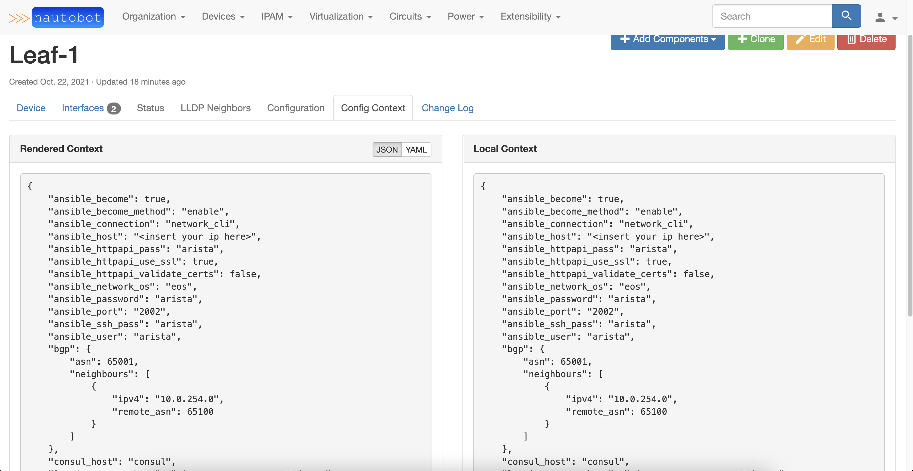

### Gitea
We use Gitea as a simple Git server to maintain and version the Ansible project that contains all the automations playbook and correlated stuff.

### Ansible+AWX
AWX will be our central point of automation, based on Ansible.
We will use AWX to have a single UI dashboard in which perform all automation jobs and workflow.

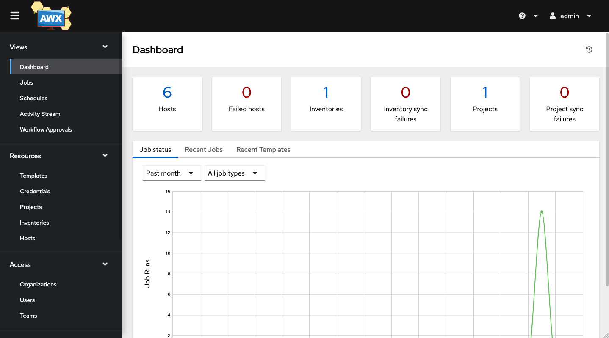

Ansible automations are launched by the AWX template jobs. We have devided all the stuff in 6 topics, corresponding to 6 Jobs Template in AWX:
* Automatically **query** all devices
  * _playbooks/test.yaml_
* Automatically **backup** all devices configurations inside a GIT repo
  * _playbooks/backup.yaml_
* Automatically launch **validation** processes
  * _playbooks/validate.yaml_
* Auotmatically deploy **configurations** on devices, and configure the monitoring stack
  * _playbooks/intended.yaml_
* Automatically **test** the final environment
  * _playbooks/ping.yaml_
* Automatically **rollback** to the previous saved configurations, in case of test failures
  * _playbooks/rollback.yaml_

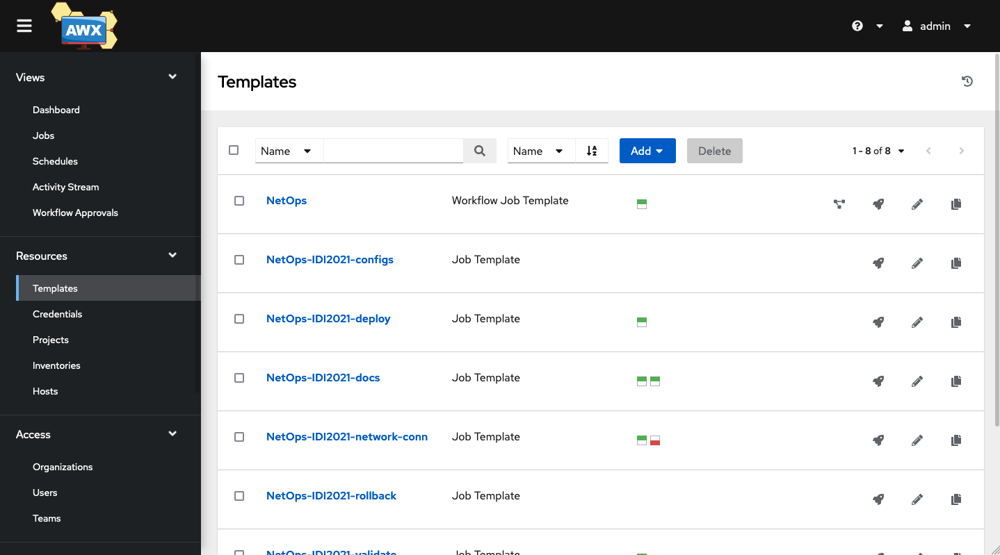

All the workflow can be assembled as follows:

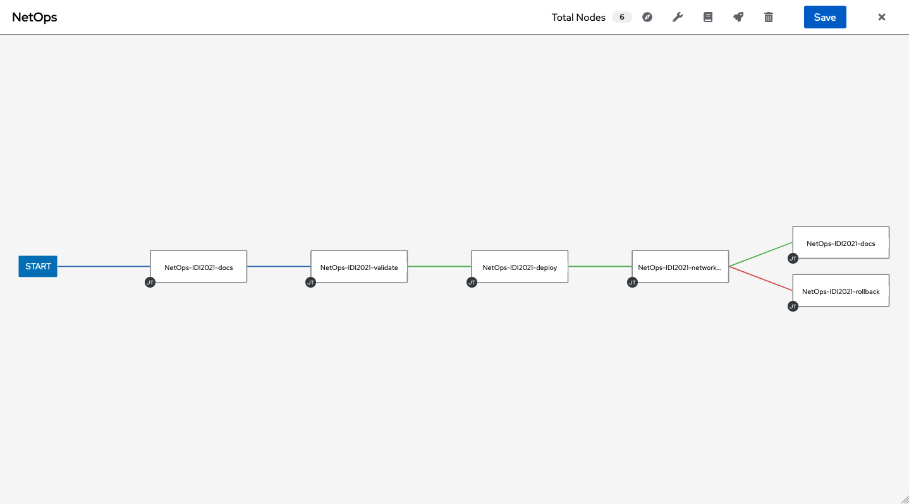

Inside the _code_ folder of this project you can find all files related to Ansible automation, regarding the NetOps process.
We use some collections and roles to perform the tasks (as you can see in the _requirements.yaml_ file):
* Collections:
  * lvrfrc87.git_acp
  * arista.eos
  * networktocode.nautobot
* Roles:
  * batfish.base

The networktocode.nautobot collection is used to get tha Ansible Inventory directly from Nautobot Source Of Truth.

```yaml
plugin: networktocode.nautobot.inventory
api_endpoint: http:/<insert your ip here>:8080
token: 0123456789abcdef0123456789abcdef01234567
validate_certs: False
config_context: True
interfaces: yes
flatten_config_context: yes
group_by:
  - device_roles
```

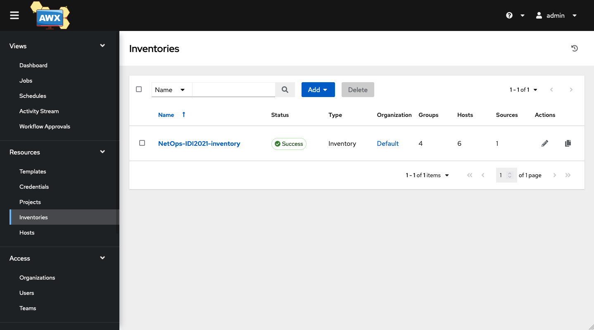

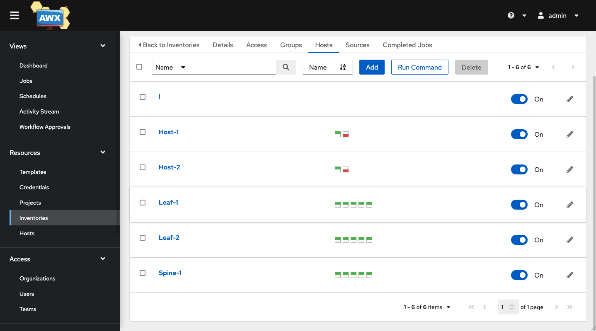

The arista.eos collection is the key to perform configuration deployment on the devices

```yaml
---
- name: Configure device
  arista.eos.eos_config:
    src: template-config-all.j2
    replace: config
    match: none
```
We use a jinja2 template, filled with information provided by the Nautobot inventory plugin, to get the final configuration.

```python
!
hostname {{ inventory_hostname }}
!
spanning-tree mode mstp
!
no aaa root
!
aaa authorization exec default local
!
username {{ management.username }} privilege 15 secret sha512 {{ management.password }}
!
ip access-list def2
   9 permit tcp any any eq 8080
   10 permit icmp any any
   20 permit ip any any tracked
   30 permit udp any any eq bfd ttl eq 255
   40 permit udp any any eq bfd-echo ttl eq 254
   50 permit udp any any eq multihop-bfd
   60 permit udp any any eq micro-bfd
   70 permit ospf any any
   80 permit tcp any any eq ssh telnet www snmp bgp https msdp ldp netconf-ssh gnmi
   90 permit udp any any eq bootps bootpc snmp rip ntp ldp
   100 permit tcp any any eq mlag ttl eq 255
   110 permit udp any any eq mlag ttl eq 255
   120 permit vrrp any any
   130 permit ahp any any
   140 permit pim any any
   150 permit igmp any any
   160 permit tcp any any range 5900 5910
   170 permit tcp any any range 50000 50100
   180 permit udp any any range 51000 51100
   190 permit tcp any any eq 3333
   200 permit tcp any any eq nat ttl eq 255
   210 permit tcp any eq bgp any
   220 permit rsvp any any
   exit
!
management api http-commands
   no shutdown
   exit

!

vlan {{ intf.untagged_vlan.vid }}
!
interface Vlan{{ intf.untagged_vlan.vid }}
   ip address {{ intf.ip_addresses[0].address }}
   exit
!
interface {{ intf.name }}
   switchport
   switchport mode access 
   switchport access vlan {{ intf.untagged_vlan.vid }}
   exit

interface {{ intf.name }}
   no switchport
   ip address {{ intf.ip_addresses[0].address }}
   exit




!
ip routing
!
route-map RMAP-CONNECTED-BGP permit 1000
!
interface Loopback0
   description ROUTER-ID
   ip address {{ routerid }}
   exit
!
router bgp {{ bgp.asn }}

   router-id {{ rid[0] }}


   neighbor {{ peer_ip }} remote-as {{ neighbor.remote_asn }}
   neighbor {{ peer_ip }} send-community
   neighbor {{ peer_ip }} maximum-routes 12000

   redistribute connected route-map RMAP-CONNECTED-BGP
   maximum-paths 2
   exit
!

!
system control-plane
   ip access-group def2 in
   exit
!
daemon TerminAttr
   exec /usr/bin/TerminAttr -disableaaa
   no shutdown
   exit
!
daemon ocprometheus
   exec /mnt/flash/ocprometheus -config /mnt/flash/ocprometheus.yml -addr localhost:6042
   no shutdown
   exit
!
logging host {{ logging_remote_host }} {{ logging_remote_port }} protocol tcp
logging format hostname fqdn
!
end
```

### Batfish
[Batfish](https://www.batfish.org/) is an open source **network configuration analysis** tool.

We have deployed a Batfish server inside our stack and we run some simple demostrative **validation** against it. As described before, we run this validations using Ansible automation.

For example, we want to validate BGP neighbourship
```yaml
- name: Generate intended config to test
  template:
    src: config.j2
    dest: "validation/workshop/configs/{{inventory_hostname}}"

- name: Setup connection to Batfish service
  bf_session:
    host: xx.xx.xx.xx
    name: local_batfish
  delegate_to: localhost
  run_once: true

- name: Initialize the example network
  bf_init_snapshot:
    network: workshop
    snapshot: workshop
    snapshot_data: ../validation/workshop
    overwrite: true
  run_once: true
  delegate_to: localhost

- name: Retrieve Batfish Facts
  bf_extract_facts:
    output_directory: ../validation/workshop/data/bf_facts
  register: bf_facts
  run_once: true
  delegate_to: localhost

- name: Display neighbourships for all nodes
  debug:
    msg: " {{item.value.BGP.Neighbors}} "
  with_dict: "{{bf_facts.result.nodes}}"
  loop_control:
    label: "{{item.key}}.BGP.Neighbors"
  run_once: true
  delegate_to: localhost

- name: Validate the configuration of network devices
  bf_assert:
    assertions:
      - type: assert_no_undefined_references
        name: Confirm that there are NO undefined references on any network device
      - type: assert_no_incompatible_bgp_sessions
        name: Confirm that all BGP peers are properly configured
      - type: assert_no_unestablished_bgp_sessions
        name: Confirm that all compatible BGP peers establish sessions
  run_once: true
  delegate_to: localhost
```

### Consul
We have introduced [Consul]() simply to simulate a **service discovery** component inside our **automation** stack.

This kind of objects are very usefull when we have to deal with automation tasks. In this way, within the _intended.yaml_ playbook, we can *register* a device to be monitored by the monitoring tools without specify any further configuration inside Prometheus

```yaml
---
- name: Register Consul service
  community.general.consul:
    service_name: "Arista Monitoring"
    service_port: "{{ metrics_port }}"
    service_id: "{{ inventory_hostname }}"
    service_address: "{{ ansible_host }}"
    host: "{{ consul_host }}"
    tags: 
      - "_device={{ inventory_hostname }}"
```

Prometheus itself has a service discovery plugin to be able to get hosts from registered device inside Consul.

### Prometheus, Loki and Grafana
Finally, as a complete Monitoring/Telemetry/Log aggregation stack we have chosen:
* [Prometheus](https://prometheus.io/)
  * scrapes metrics information of the Arista devices, both directly (thanks to OCPrometheus daemon inside EOS) and via custom eAPI exporter (just for demonstration sake, it is absolutely not necessary to run both mechanisms)
* [Loki](https://grafana.com/oss/loki/)
  * scrapes devices logs, through the help of [Promtail](https://grafana.com/docs/loki/latest/clients/promtail/) (make log available for scraping) component and [Syslog-NG](https://www.syslog-ng.com/) ( first catches and parses logs)
* [Grafana](https://grafana.com/oss/grafana/)
  * provides visualization dashboards

# How to reproduce the demo environment

 There are some requirements to reproduce this demo enviroment:
* python3
* pip3
* Python virtualen
* Docker
* Docker Compose
* Ansible

## AWX

First of all, we need to clone AWX 17.1.0 and move to `installer\`

```bash
git clone -b 17.1.0 https://github.com/ansible/awx.git
cd installer\
```

in this directory you will find:
```
installer
|-- build.yml
|-- install.yml
|-- inventory
`-- roles
```
Inside of `inventory`, you will find all parameters that you might need to change like `admin_user` and `admin_password`. 
You might want to change the default `admin:password` with something more robust like `admin:IDI2021` 🙂 .

then, run the playbook `install.yml` with the inventory previously edited.
```bash
sudo ansible-playbook install.yml -i inventory
```
> This procedure will take some time and may take more than one try to reach the end.

when everything is complete you will find a new directory `~\.awx` in this directory you will find the docker-compose used to run all the AWX stack.

At this point, everything is up and running!


> You can access AWX by the IP address of your host. By default, the Web service will be exposed at port 80.

## Rest of the Stack

First clone this repository on your server and chanage directory inside the root.

Then create the virtualenv and install all the python requirements (this action could takes long to finish)

```console
foo@bar:~$ cd yanq
foo@bar:~$ virtualenv .venv
foo@bar:~$ source .venv/bin/activate
(.venv)foo@bar:~$ cd demo_build
(.venv)foo@bar:~$ pip install -r requirements.txt
```

Download from Arista portal the latest cEOS images and put it inside the topology folder, with the name _cEOS-Lab.tar.xz_

```console
(.venv)foo@bar:~$ ls -al topology

total 391776
drwxrwxr-x 4 ubuntu ubuntu      4096 May  7 15:17 .
drwxrwxr-x 8 ubuntu ubuntu      4096 May  7 14:28 ..
drwxrwxr-x 2 ubuntu ubuntu      4096 May  7 15:15 alpine-host
-rw-r--r-- 1 ubuntu ubuntu 401152996 May  7 15:13 cEOS-Lab.tar.xz
drwxrwxr-x 2 ubuntu ubuntu      4096 May  7 15:17 configs
-rw-rw-r-- 1 ubuntu ubuntu       638 May  7 14:28 topology.yaml
```

Now within the virtual environment you can launch Ansible automation that builds all the infrastructure (it will takes approximately 4 minutes)

```console
(.venv)foo@bar:~$ ansible-playbook build.yml


PLAY [lab] *************************************************************************************************************************************************************************

TASK [build : Generate SSH key pair for Hosts in topology] *************************************************************************************************************************
changed: [Spine-1]

TASK [build : Build Host docker image] *********************************************************************************************************************************************
changed: [Spine-1]

TASK [build : Import & Build cEOS image] *******************************************************************************************************************************************
changed: [Spine-1]

TASK [build : Generate Arista configuration from templates] ************************************************************************************************************************
changed: [Spine-1]
changed: [Leaf-1]
changed: [Leaf-2]

TASK [build : Start Arista topology] ***********************************************************************************************************************************************
changed: [Spine-1]

TASK [build : Pause for 30 seconds to topology creation] ***************************************************************************************************************************
Pausing for 30 seconds
(ctrl+C then 'C' = continue early, ctrl+C then 'A' = abort)
ok: [Spine-1]

TASK [build : Copy OCPrometheus binary and configuration] **************************************************************************************************************************
changed: [Spine-1]
changed: [Leaf-1]
changed: [Leaf-2]

TASK [build : Pause for 90 seconds to topology up & running] ***********************************************************************************************************************
Pausing for 90 seconds
(ctrl+C then 'C' = continue early, ctrl+C then 'A' = abort)
ok: [Spine-1]

TASK [build : Start all stack architecture] ****************************************************************************************************************************************
changed: [Spine-1]

PLAY RECAP *************************************************************************************************************************************************************************
Leaf-1                     : ok=2    changed=2    unreachable=0    failed=0    skipped=0    rescued=0    ignored=0
Leaf-2                     : ok=2    changed=2    unreachable=0    failed=0    skipped=0    rescued=0    ignored=0
Spine-1                    : ok=10   changed=7    unreachable=0    failed=0    skipped=0    rescued=0    ignored=0

```

You can re-use an example PostgreSQL dump, inside the _nautobot_export_ folder, to have your Nautobot instance populated.

## Post actions

Create a git repository on Gitea and push the code that is contained insed the _code_ folder.

Create also another empty git repository, called Arista, that will contain the backup of the devices configurations.

Access AWX dashboard and create the following:
 * New **Project** associated with the brand new repo you've just pushed
 * An **Inventory** with Git source taken from the same project, specifically the _inventory.yaml_ inside the root of the folder
 * A **Job Template** for each playbook  
 * A **Workflow Template** collecting all the Job Template you have created

 Inside AWX, as requirements, you have also to create some credentials:
  * Ansible Galaxy credential
  * Git user
  * SSH key for accessing the Hosts (use the content of _demo.key_ file, created by the build procedure inside _demo_build/topology/alpine-host_ folder, to load the private key)

You can now launch the Workflow Template and let the magic happen!

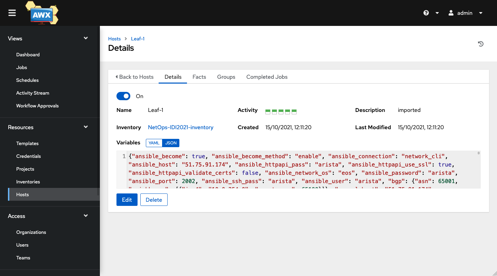

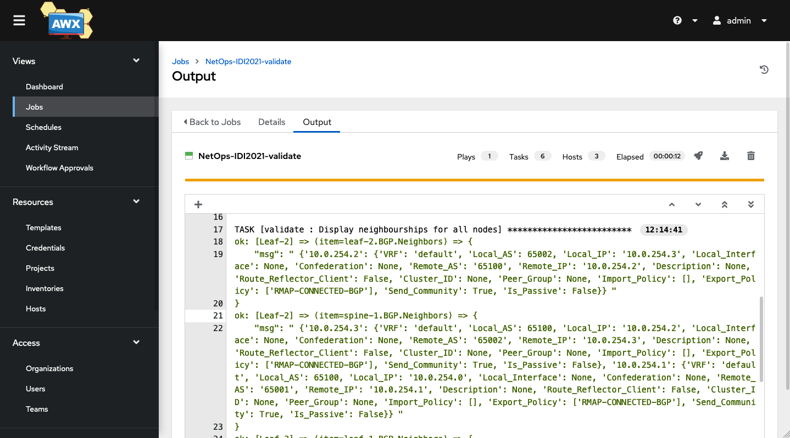

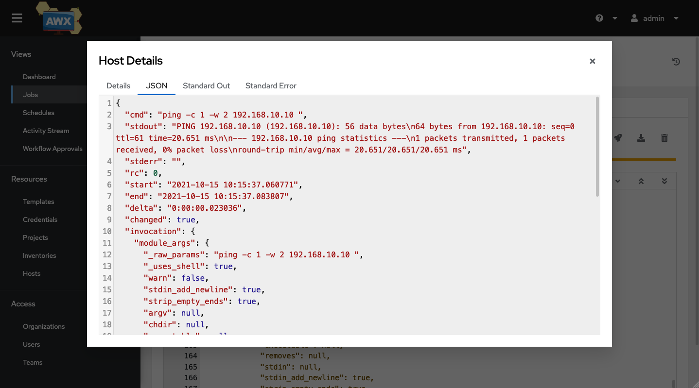

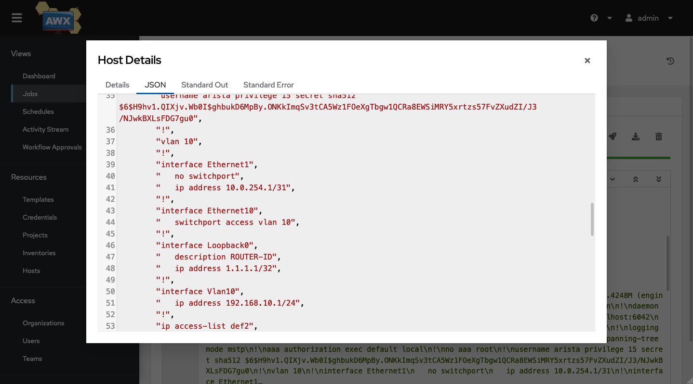

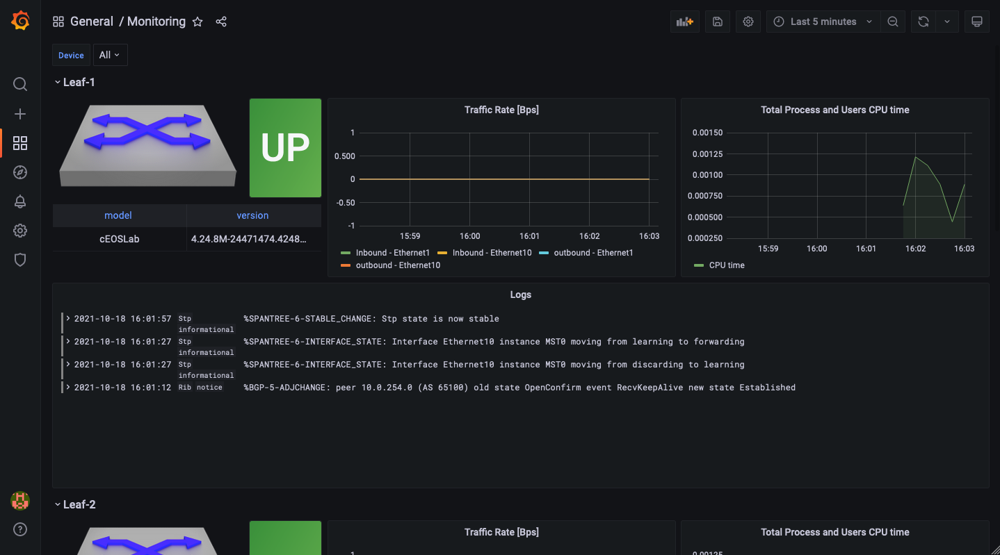


